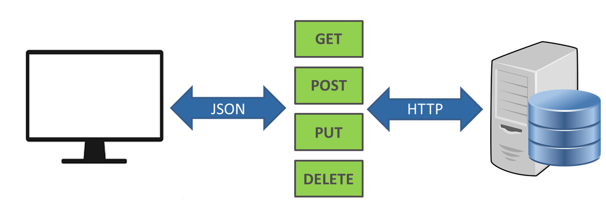
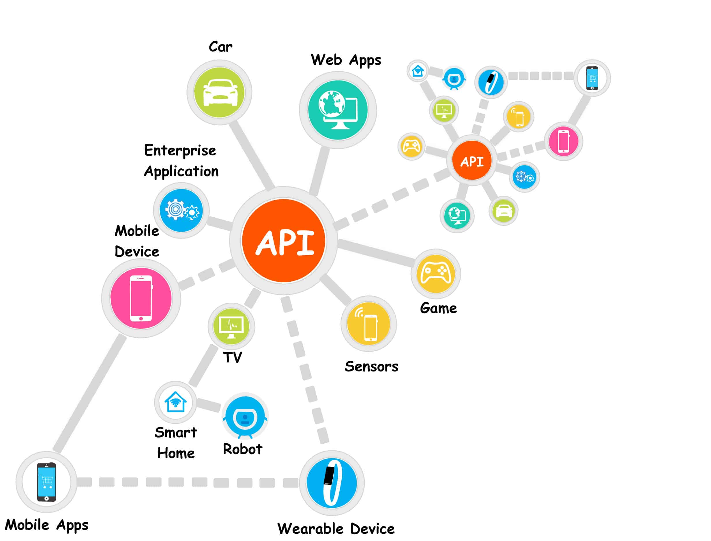

# Introduction to APIs 🛰

## What is API 🔸

Web applications need an interface for users to interact with them. This interface is usually a view, an HTML page that they can see and interact with. But this is not the only way of giving an interface to the user. A simpler and more universal way is for the user to interact with features of the web applications by sending and receiving requests directly. This means the application is not fixed to one view or an HTML and can give out data to anyone who asks for it. This sort of application is called an API ( Application Programming Interface ).

### What is REST 🔽

There are many software architecture designs that we can use when building web applications. This means that there are also architecture designs specially created to organize and structure an API application as well. One of those architectural designs is REST (Representational State Transfer). REST's main principle is separating the client and the server by exposing representations of the data the user needs in a way that both sides can understand. For them to be separated the server application and the server should not know one another inner workings, only the data they need to send or receive which is in a package they both understand ( xml/json ). Applications following these constraints are called RESTful.

### Uses of APIs 🔽

APIs are very useful because they are independent of the client. This means that the client or clients can be anything as long as it knows how to request data from the API and read the data that it receives. This makes a back-end application built as API to serve a mobile application on the front end and a web application at the same time. They can also communicate with other web services such as other web APIs.

## How to build an API 🔸

### ASP.NET Core WebApi 🔽

Since the rules and concept of an API are not connected to any particular programming language or framework we can build them with any back-end language. Building an API in .NET is pretty easy because ASP.NET supports building WebAPI applications and gives us libraries and tools to build them easier and faster. The WebAPI project is very similar to the MVC project with some differences in configuration and the lack of views.

### Setup 🔽

To create a WebAPI project in ASP.NET Core we need to first select the ASP.NET Core Web Application template. When we select this template we will get the usual options. Here we select the API option. This creates a template of an API web application the same as it did with MVC. It creates the configurations, the folder structure as well as a starter controller and actions.

## Extra Materials 📘

* [What exactly is an API](https://medium.com/@perrysetgo/what-exactly-is-an-api-69f36968a41f)
* [Simple Explanation of REST](https://medium.com/extend/what-is-rest-a-simple-explanation-for-beginners-part-1-introduction-b4a072f8740f)
